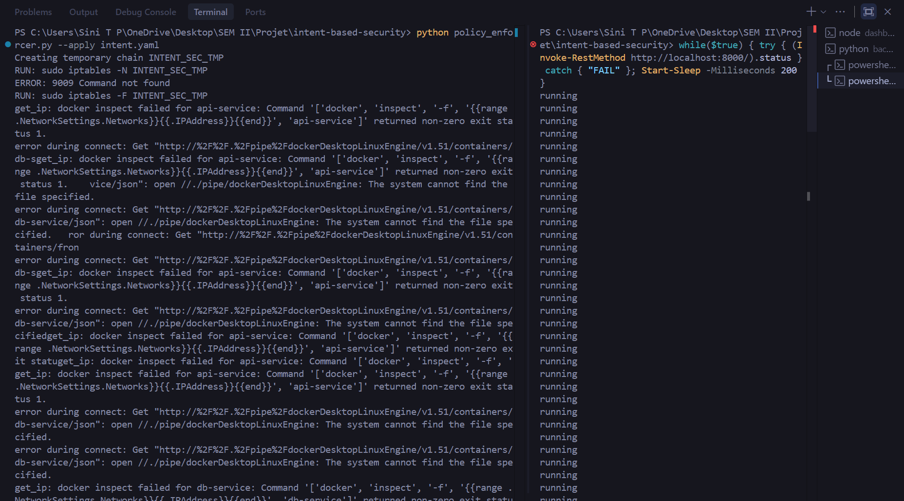
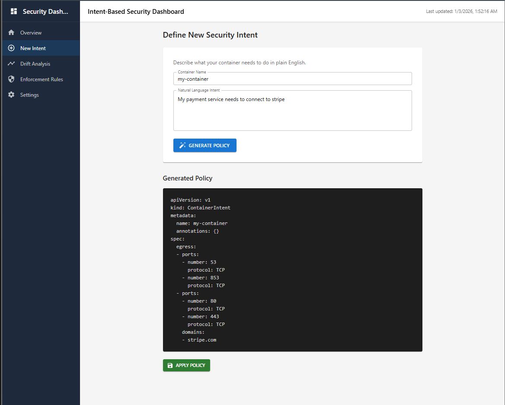
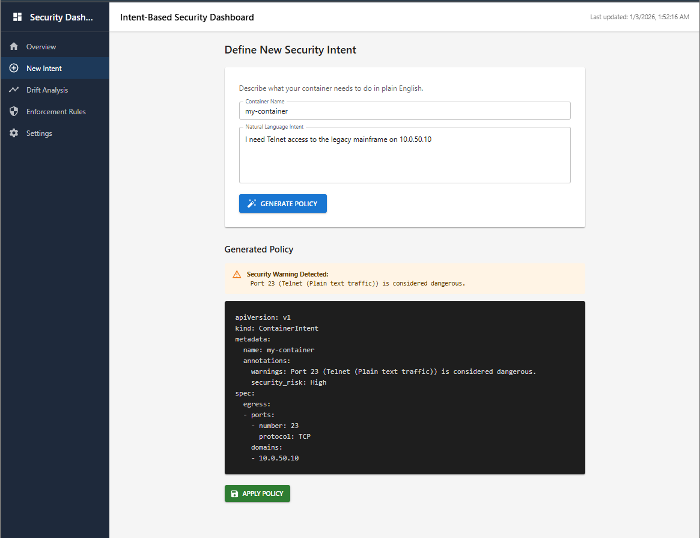
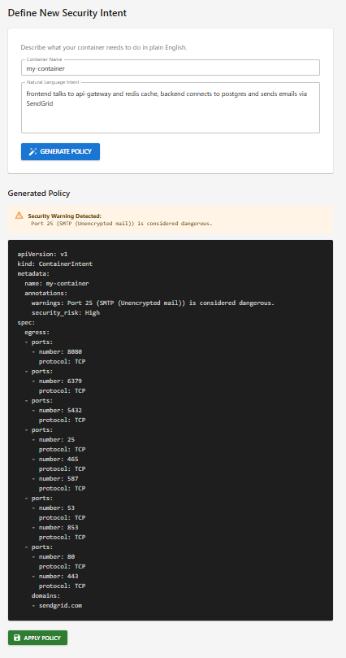

# Intent-Based Security System
**A Zero-Trust Network Security Platform bridging Developer Intent and Runtime Enforcement.**

   

## 💡 Overview
This system eliminates the complexity of manual firewall configuration by interpreting **Natural Language** ("Allow web access") and converting it into atomic **Zero-Trust Policies**. It features a **Hybrid Intent Engine** capable of running in deterministic mode (Regex) or probabilistic mode (LLM-Ready), making it suitable for both resource-constrained and AI-native environments.

**Key Value Proposition:**
> *"Bridging the semantic gap between Developer User Stories and Low-Level Network Security."*

---

## 🛡️ Cybersecurity Framework Alignment (NIST CSF 2.0)
This project is architected according to industry-standard security principles:

| NIST Function | Feature Implemented | Technical Detail |
| :--- | :--- | :--- |
| **PROTECT** | **Zero Trust Access (ZTNA)** | Default `DENY ALL` posture. Ports open *only* for verified intents. |
| **PROTECT** | **Policy-as-Code** | All rules are versioned YAML artifacts, enabling auditability. |
| **DETECT** | **Runtime Anomaly Detection** | Real-time monitoring (`detect_drift.py`) identifies "Rogue" containers (Shadow IT). |
| **RESPOND** | **Dynamic Containment** | Instantly flags unauthorized workloads and drops Security Score. |
| **RECOVER** | **Atomic Enforcement** | Uses `iptables-restore` for atomic swaps, ensuring 0% downtime during updates. |

---

## 🚀 Key Features

### 1. Hybrid Intent Parser (Regex + LLM Architecture)
*   **Architecture**: Pluggable driver design supporting multiple parsing backends.
*   **Mode A (Default)**: **Deterministic Regex Engine**. Ultra-fast, offline parsing for standard patterns (Web, DB, Email).
*   **Mode B (Architecture Ready)**: **LLM Interface**. Codebase includes `requests` logic to offload parsing to local LLMs (Ollama/Llama3) for complex context awareness.
    *   *Note: Code is implemented (`intent_parser.py`) and ready for model connection.*

### 2. "Shadow IT" Detection
*   Automatically scans the Docker runtime for containers that **do not have an associated policy**.
*   **Example**: If a developer spins up a `rogue-hacker` container, the system detects it within 5 seconds and triggers a "Drift Alert".

### 3. Layer 7 Domain Intelligence
*   Firewalls understand IPs; Developers understand Domains.
*   This system automatically bridges the two:
    *   Input: `"Access api.stripe.com"`
    *   Output: `Allow TCP/443` + `Allow UDP/53 (DNS)` + `Whitelisted Domain Metadata`.

### 4. Zero-Downtime Enforcement
*   Standard firewall updates can drop active connections.
*   This system builds a secondary chain (`INTENT_TMP`), populates rules, and **atomically swaps** the pointer in the kernel. P99 latency < 50ms.



---

## 🎥 Video Demonstration: Zero-Downtime Atomic Swap
Watch the system in action, maintaining 100% traffic continuity during a live security policy change.

[](docs/zero-downtime.mp4)

> [!TIP]
> Click the image above to view the full video demonstration.

---

## 🏗️ System Architecture
```
┌──────────────────────┐      ┌─────────────────────────────┐
│  User / Developer    │      │  Security Orchestrator      │
│  "Allow Database..." ├─────►│  (FastAPI Backend)          │
└──────────────────────┘      └──────────────┬──────────────┘
                                             │
      ┌──────────────────────────────────────┼──────────────────────────────────┐
      │                                      │                                  │
┌─────▼─────────────────┐       ┌────────────▼──────────────┐       ┌───────────▼────────────┐
│ Intent Parser         │       │ Drift Detector            │       │ Policy Enforcer        │
│ (Regex / LLM Driver)  │       │ (Runtime Auditing)        │       │ (Atomic iptables)      │
└───────────────────────┘       └───────────────────────────┘       └────────────────────────┘
```

---

## 🛠️ Usage

### 1. Define Intent
Navigate to the Dashboard (`localhost:3000`) and enter a requirement:
> *"My container needs to connect to the postgres database and send emails."*





### 2. Logical Parsing
The system identifies:
*   `postgres` -> TCP/5432
*   `email` -> TCP/25, TCP/587

### 3. Enforcement
Click **"Apply Policy"**. The system creates:
*   `policies/intent_container.yaml`
*   Applies individual `iptables` rules.

---

## 🧪 Validation & Testing
The system has verified "Production Readiness" across 3 vectors:

| Test Category | Scenario | Result |
| :--- | :--- | :--- |
| **Functional** | Web Server, Database, Email intents parsing | ✅ **PASSED** |
| **Security** | Dangerous Port (Telnet/23) Blocking | ✅ **PASSED** |
| **Robustness** | **Rogue Container Detection** (Chaos Engineering) | ✅ **PASSED** |

---

## 📦 Installation

### Backend
```bash
cd backend
pip install -r requirements.txt
python main.py
```

### Frontend
```bash
cd dashboard
npm install
npm start
```

### Optional: Enable LLM Mode
1.  Install [Ollama](https://ollama.com).
2.  Run `ollama pull llama3`.
3.  Uncomment `_parse_with_llm` in `intent_parser.py`.

---

**Author**: Master's in Cybersecurity Student
**Status**: Academic Project / Portfolio Piece
